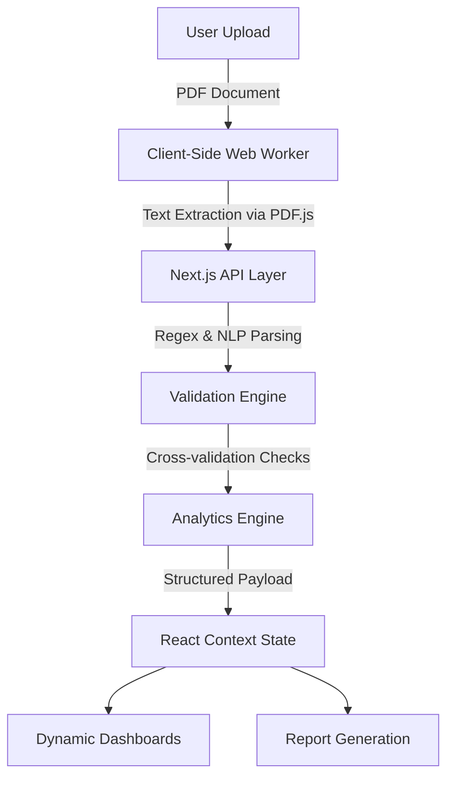

# LedgerIQ

LedgerIQ is a comprehensive financial intelligence and risk analysis platform engineered to solve the persistent challenge of manual data extraction from complex corporate documents. By automatically converting unstructured PDF SEC filings into structured, multi-dimensional metrics, the system eliminates error-prone manual data entry and drastically accelerates fundamental analysis. Built to demonstrate a robust, full-stack architecture handling complex unstructured data, LedgerIQ provides immediate value through automated extraction, rigorous structural validation, and instant strategic reporting.

## Live Demo

Production: https://vercel.com/aayushhh4518s-projects/ledgeriq

Repository: https://github.com/Aayushhh4518/ledgeriq

## Project Highlights

* Automated financial statement extraction
* Financial validation engine
* Multi-module analysis platform
* Executive reporting system
* Production deployment on Vercel
* TypeScript architecture

## System Architecture

The platform operates on a robust, edge-optimized architecture designed to bypass serverless execution constraints and payload limits. 



1. **Client-Side Extraction**: Documents are parsed natively in the browser using a dedicated Web Worker to extract raw text, circumventing backend payload limitations.
2. **Backend Parsing**: The extracted text is processed by a Next.js API route utilizing custom regex and natural language heuristics to map financial figures.
3. **Validation Engine**: Data undergoes structural cross-validation (e.g., verifying assets equal liabilities plus equity) to guarantee integrity.
4. **Analytics & State**: Validated metrics are pushed to a global React context, feeding immediately into discrete analytical modules.

## Key Features

### Financial Intelligence
* Extracts raw statements and computes multi-layered analyses including DuPont models, ratio breakdowns, and earnings quality assessments.
* Benches extracted metrics against established industry peers to provide contextual performance evaluations.

### Risk Intelligence
* Evaluates corporate solvency and computes granular liquidity ratios to determine near-term and long-term financial health.
* Assesses revenue concentration risks and validates the structural integrity of the uploaded financial data.

### Strategic Intelligence
* Synthesizes fundamental data to formulate structural bull and bear cases for the underlying asset.
* Detects latent strategic opportunities and surfaces critical risk flags for executive review.

### Reporting & Exports
* Compiles complex React components and SVG charts into comprehensive, downloadable PDF executive briefs.
* Executes rendering entirely on the client side, bypassing the need for heavy headless browser infrastructure.

### Developer Features
* Features a robust extraction debugger providing deep visibility into raw parsing logs, confidence scores, and missing fields.
* Enforces strict TypeScript definitions across the entire application to eliminate runtime calculation errors.

## Technology Stack

**Frontend & Framework:**
* **Next.js**: Selected for its App Router architecture, built-in API routes, and advanced rendering strategies required for scalable financial dashboards.
* **React**: Utilized for building modular, highly interactive client-side user interfaces and complex data grids.
* **TypeScript**: Enforces strict type safety across intricate financial data structures, ensuring robust state management.
* **Tailwind CSS**: Enables rapid, utility-first UI development while maintaining a consistent and highly customized design system.

**Visualization:**
* **Recharts**: Provides highly performant, accessible, and responsive SVG charts necessary for rendering dense financial trends.

**Deployment:**
* **Vercel**: Chosen for its native Next.js support, edge caching, and seamless serverless function deployment.

## Project Structure

```text
src/
├── app/          # Next.js App Router pages and API routes
├── components/   # Modular React components and UI elements
├── contexts/     # Global state management for financial data
├── lib/          # Core extraction, validation, and utility functions
└── types/        # Strict TypeScript interfaces and type definitions
```

## Core Pages

| Page | Purpose | Functionality |
|------|---------|---------------|
| Dashboard | Executive overview | Displays high-level health scores, key metrics, and immediate risk flags. |
| Financial Analysis | Fundamental breakdown | Renders DuPont analysis, ratio deep-dives, and industry benchmarking. |
| Risk Analysis | Solvency and liquidity | Evaluates balance sheet strength, earnings quality, and revenue concentration risks. |
| Growth Analysis | Performance tracking | Visualizes historical trends and segment-specific revenue growth patterns. |
| Strategic Insights | AI recommendations | Surfaces bull/bear cases and synthesizes overall strategic opportunities. |
| Reports | Documentation generation | Compiles comprehensive PDF briefs for investor or internal use. |
| Debug | Extraction transparency | Displays raw parsing logs and confidence scores for the extraction engine. |

## Installation

Clone the repository and install dependencies:

```bash
git clone https://github.com/Aayushhh4518/ledgeriq.git
cd ledgeriq
npm install
```

## Local Development

Start the local development server:

```bash
npm run dev
```

## Production Build

Compile the application for production testing:

```bash
npm run build
npm start
```

## Deployment

The application is configured for direct deployment to Vercel. Push changes to the `main` branch connected to a Vercel project. The deployment pipeline will automatically run `npm run build`. Note that the application utilizes client-side PDF extraction to bypass Vercel's serverless payload constraints, ensuring stable processing of large documents without requiring custom infrastructure configurations.

## Key Engineering Challenges

* **PDF Extraction Architecture:** Bypassed standard serverless payload limits (4.5 MB on Vercel) by executing heavy text extraction natively in the browser via Web Workers, transmitting only lightweight strings to the backend.
* **PDF.js Worker Deployment:** Resolved severe Next.js Webpack parsing conflicts by securely exposing the production worker via `import.meta.url` and Turbopack static emission, abandoning unstable and CORS-restricted CDN loading strategies.
* **Financial Validation Logic:** Built a multi-pass cross-validation engine to ensure balance sheets reconcile against income statements and catch omissions caused by varying global accounting standards.
* **Report Generation:** Integrated `html2canvas-pro` and `jspdf` to guarantee that complex SVG charts and dark-mode styled layouts render perfectly into downloadable PDFs, entirely eliminating the need for a server-side headless browser backend.
* **Production Deployment:** Mitigated Vercel's 10-second serverless execution timeouts by shifting time-intensive document parsing exclusively to the client edge, guaranteeing stable interactions.

## Future Roadmap

* Multi-company portfolio analysis
* Historical trend forecasting
* LLM-powered document Q&A
* Real SEC API integration
* Portfolio risk simulation

## Author

**Aayush Patil**  
B.Tech Artificial Intelligence  
GitHub: [Aayushhh4518](https://github.com/Aayushhh4518)  

